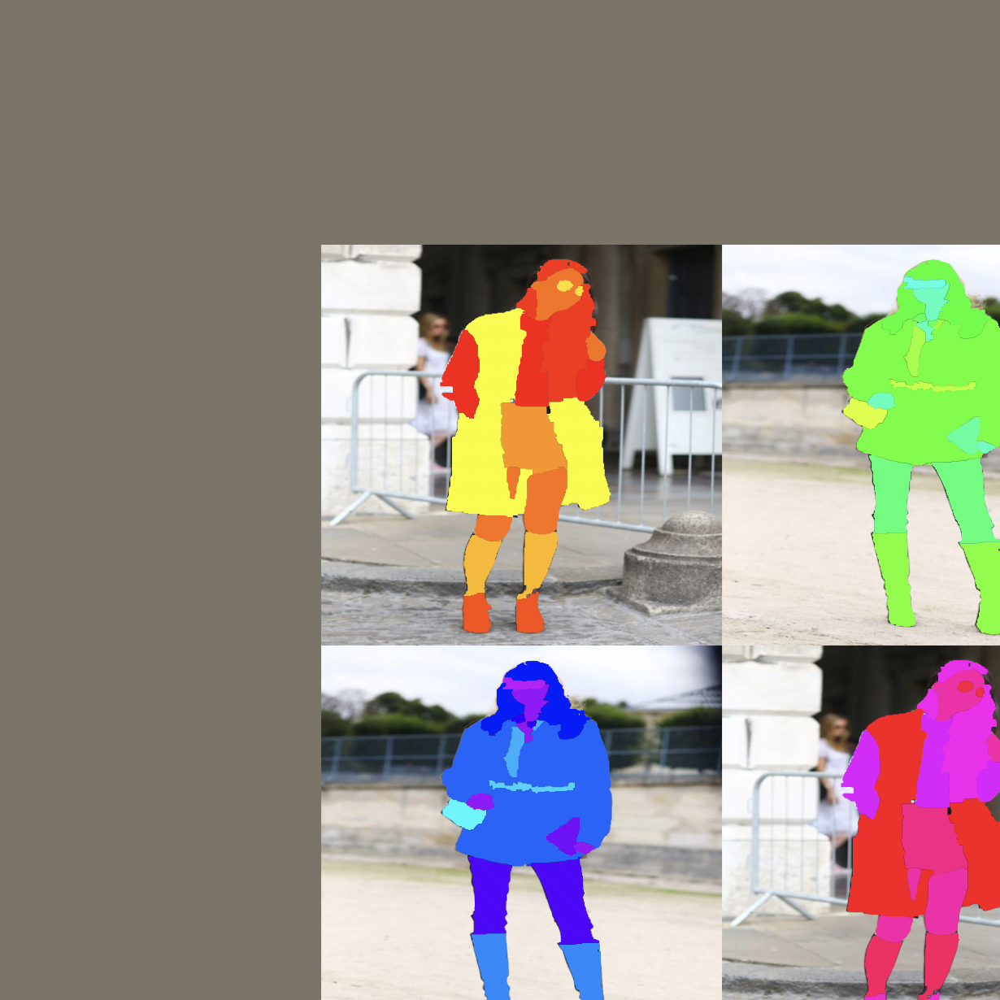
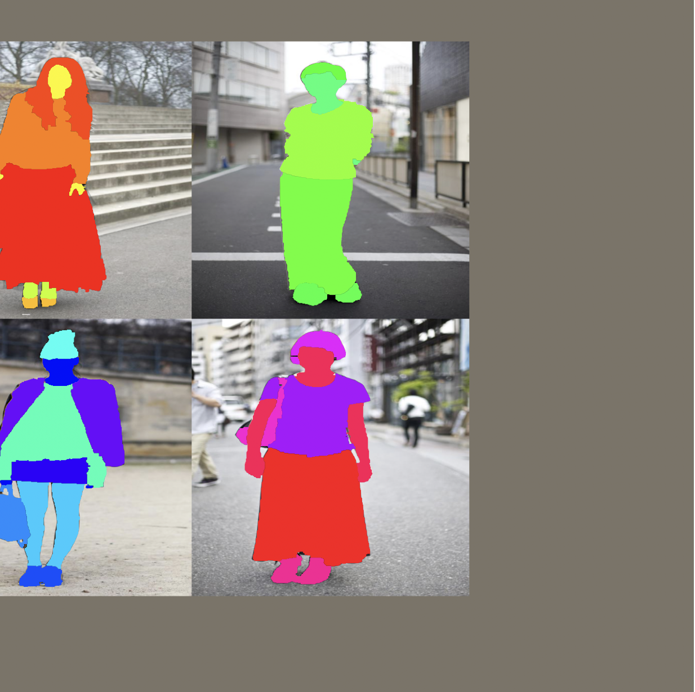

# mosaic-augmentation-py-cpp
Implementation of mosaic augmentation (2x2) with Pytorch Lightning and C++ Backbone [WIP]

  
  

## Getting Started

run the python version right away:
python -m src_python.mosaic_augmentatio